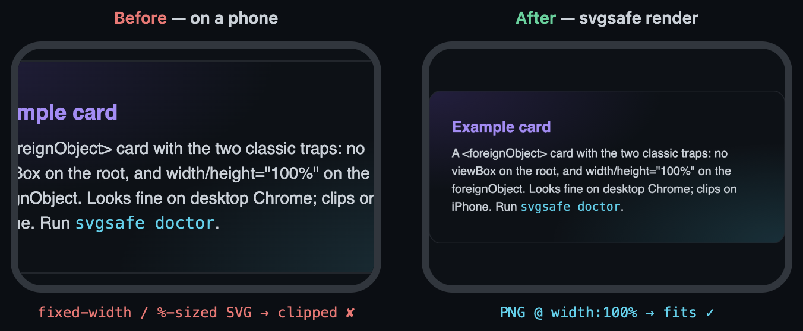
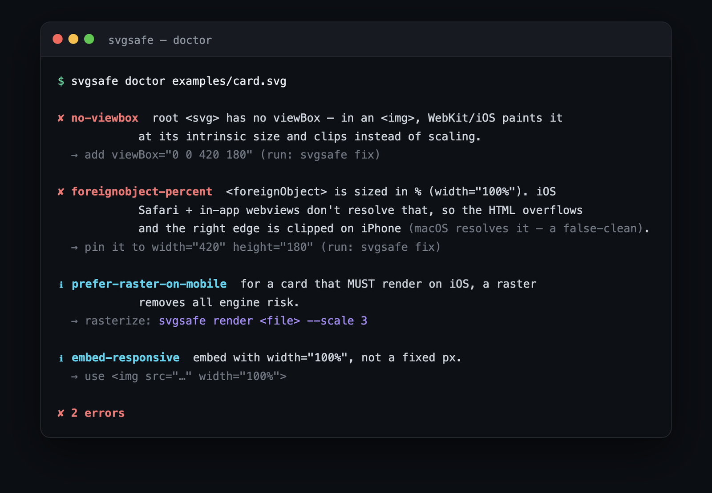

<div align="center">

# 🩹 svgsafe

### Make SVGs render everywhere — especially on iPhone

An SVG that embeds HTML (`<foreignObject>` — what metrics cards, badges, and many
diagram tools emit) looks perfect on desktop Chrome and **clips on iOS Safari**.
`svgsafe` **diagnoses** that trap, **fixes** it, or **rasterizes** to a crisp,
transparent PNG that renders identically on every device.

[](https://github.com/convenientlymike/svgsafe/actions/workflows/ci.yml)
&nbsp;
&nbsp;
&nbsp;
&nbsp;
&nbsp;

[**▶️ Try it live**](https://convenientlymike.github.io/svgsafe/)
&nbsp;·&nbsp;
[](https://stackblitz.com/github/convenientlymike/svgsafe)
&nbsp;
[](https://codespaces.new/convenientlymike/svgsafe)


</div>

---

## ▶️ Try it

- **In your browser (no install):** the [**live playground**](https://convenientlymike.github.io/svgsafe/) runs the real `doctor` + `fix` engines 100% client-side — paste an SVG, see the traps, fix them.
- **Full CLI in the cloud:** [Open in Codespaces](https://codespaces.new/convenientlymike/svgsafe) or [StackBlitz](https://stackblitz.com/github/convenientlymike/svgsafe).
- **Zero-install CLI:**
  ```bash
  npx github:convenientlymike/svgsafe doctor card.svg
  ```

## Why

You commit a beautiful SVG card to your README. On desktop it's flawless. Then you
open your profile on your phone and the right edge is **sliced off**.

> The culprit is `<foreignObject>` + WebKit. iOS Safari (and every iOS in-app browser
> — Instagram, Facebook…) won't resolve a `%`-sized foreignObject or scale a
> viewBox-less SVG, so the card overflows and clips. **Desktop Chrome scales it anyway,
> so the bug is invisible until someone opens it on a phone.** `svgsafe` makes it
> impossible to miss — and trivial to fix.

## ✨ Features

### 🩺 `doctor` — catch the trap before it ships
- Flags the **two clipping bugs**: a root `<svg>` with **no `viewBox`**, and a
  `<foreignObject>` sized in **`%`** (the iOS overflow).
- Explains *why* each one clips on iOS but not desktop, with the exact fix. Exit code
  `1` on errors, so it drops straight into CI.

### 🔧 `fix` — repair it in place, idempotently
- Adds a `viewBox` derived from the canvas and **pins the `foreignObject` to pixels**.
- Prints to stdout (pipe-friendly) or writes back with `--write`. Re-running is a no-op.

### 🖼 `render` — rasterize to a crisp, transparent PNG
- A raster renders **identically in every engine** — and your desktop check becomes
  authoritative for iOS. Drives an **already-installed Chrome** (never downloads one).
- `--scale 3` by default → sharp on Retina; transparent background preserved.

### 🧰 Built right
- **Zero runtime dependencies.** **Cross-platform** (macOS · Linux · Windows), proven
  by the CI matrix. TypeScript, tested with `node:test`.

## 📸 A look inside

| | |
|---|---|
|  |  |
| **The bug → the fix.** A fixed-width / `%`-sized card slices off on a phone; the `svgsafe` PNG fits edge-to-edge. | **`svgsafe doctor`** names both traps and the exact repair — green-or-`exit 1` for CI. |

## 🚀 Quickstart

| Prerequisite | Notes |
|---|---|
| Node ≥ 18 | for the CLI |
| Chrome / Chromium | only for `render` (any installed build; never downloaded) |

```bash
# zero-install
npx github:convenientlymike/svgsafe doctor card.svg
npx github:convenientlymike/svgsafe fix card.svg --write
npx github:convenientlymike/svgsafe render card.svg --scale 3 -o card.png

# or clone
pnpm install && pnpm build
node dist/cli.js doctor examples/card.svg
```

Override which browser `render` uses with `$SVGSAFE_CHROME=/path/to/chrome`.

## 🏗 How it works

Two WebKit/iOS failures clip a `<foreignObject>` SVG embedded via `` — both
invisible on desktop Chromium:

```
  ┌─ no viewBox ──────────────┐   WebKit paints at intrinsic width and CLIPS;
  │  <svg width=480 height=…> │   it won't scale to the element's CSS width.
  └───────────────────────────┘   fix → add viewBox="0 0 W H"

  ┌─ foreignObject width=100% ┐   iOS Safari can't resolve the %, the inner HTML
  │  <foreignObject 100%>     │   lays out at natural width and OVERFLOWS → clipped.
  └───────────────────────────┘   fix → pin to explicit px  ·  or rasterize to PNG
```

`doctor` detects them, `fix` repairs them, and `render` sidesteps the whole class by
producing a raster. Try it on the
[**live playground**](https://convenientlymike.github.io/svgsafe/) — it runs the same
`doctor` / `fix` engines in your browser.

## 📂 Project layout

```
src/
  cli.ts        # arg parsing + dispatch (doctor · fix · render)
  doctor.ts     # the diagnostics (codes, messages, fixes)
  fix.ts        # idempotent viewBox + foreignObject repair
  render.ts     # SVG → transparent PNG via headless Chrome
  chrome.ts     # cross-platform Chrome resolver (no download)
  svg.ts        # tiny dependency-free SVG attribute helpers
docs/index.html # the in-browser playground (GitHub Pages)
examples/       # a sample foreignObject card
test/           # node:test suite
```

## 🔒 Security

No network, no telemetry, zero runtime dependencies. `render` drives an installed
Chrome on a `file://` URL — review untrusted SVGs with `doctor` first. See
[SECURITY.md](SECURITY.md).

## License

[MIT](LICENSE) © 2026 convenientlymike

<div align="center"><sub><em>Looks fine on desktop ≠ looks fine on iPhone. Now you'll know.</em></sub></div>
